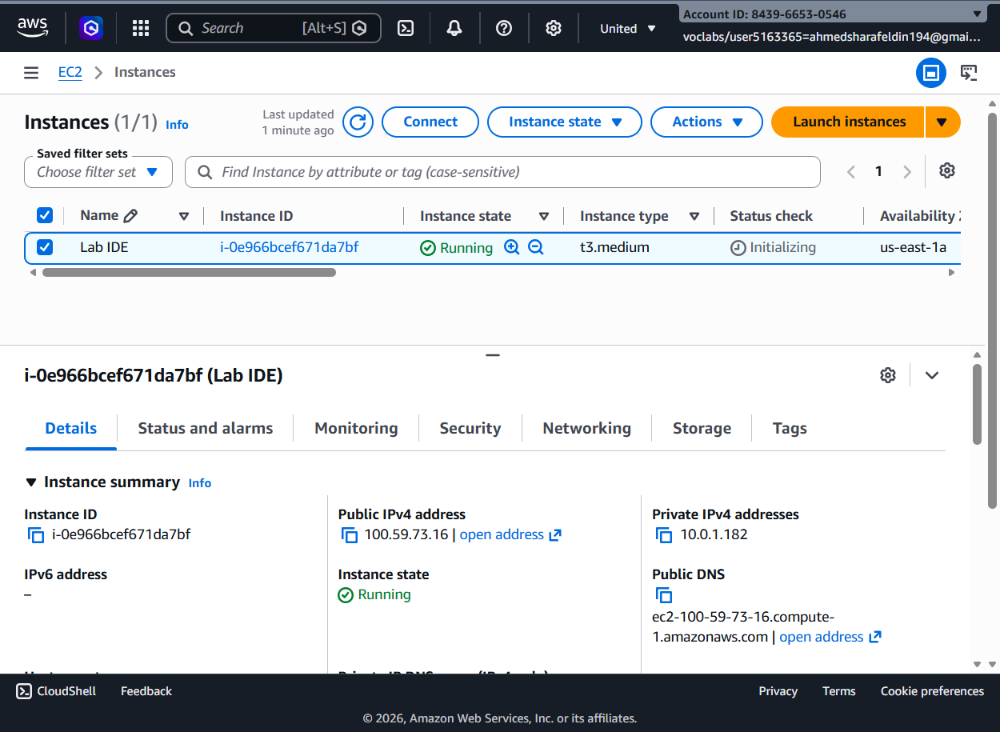
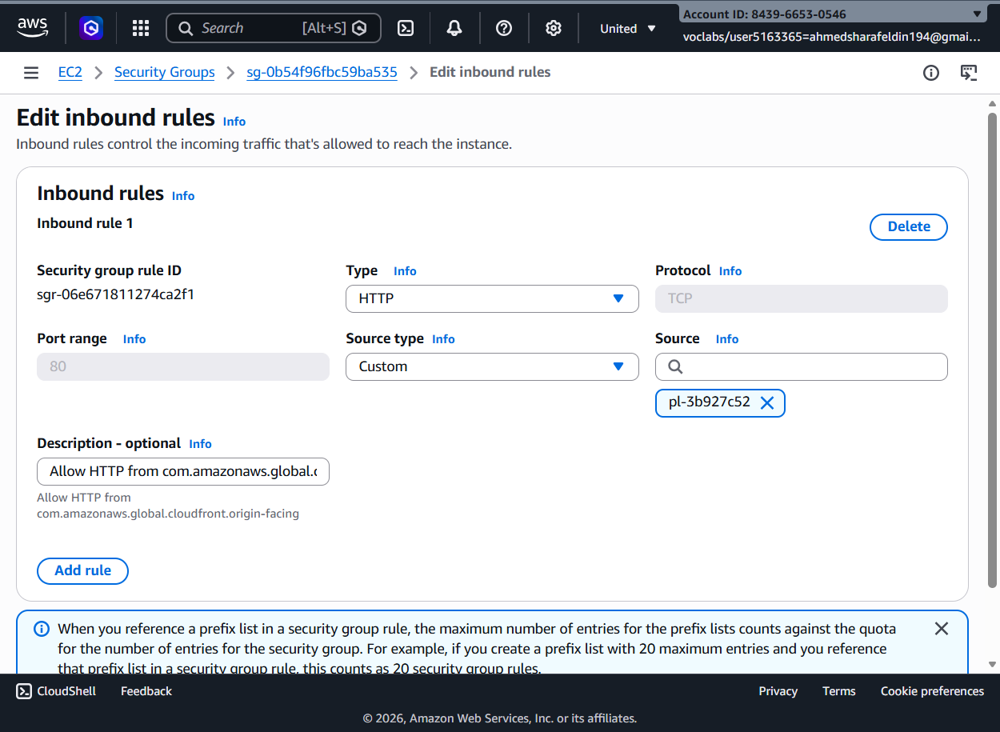
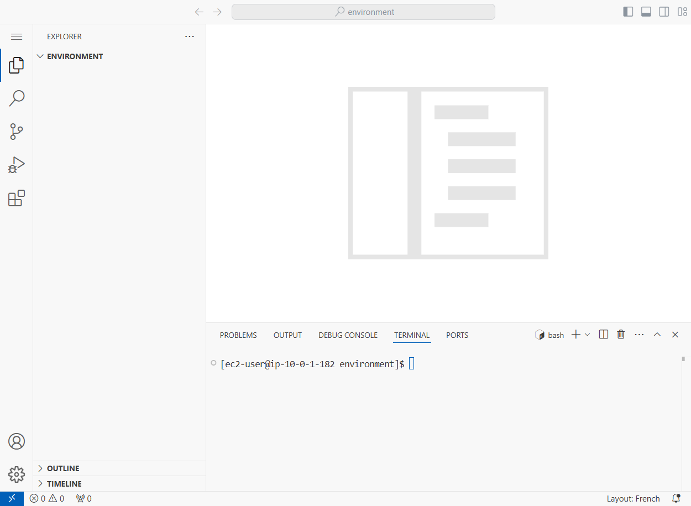
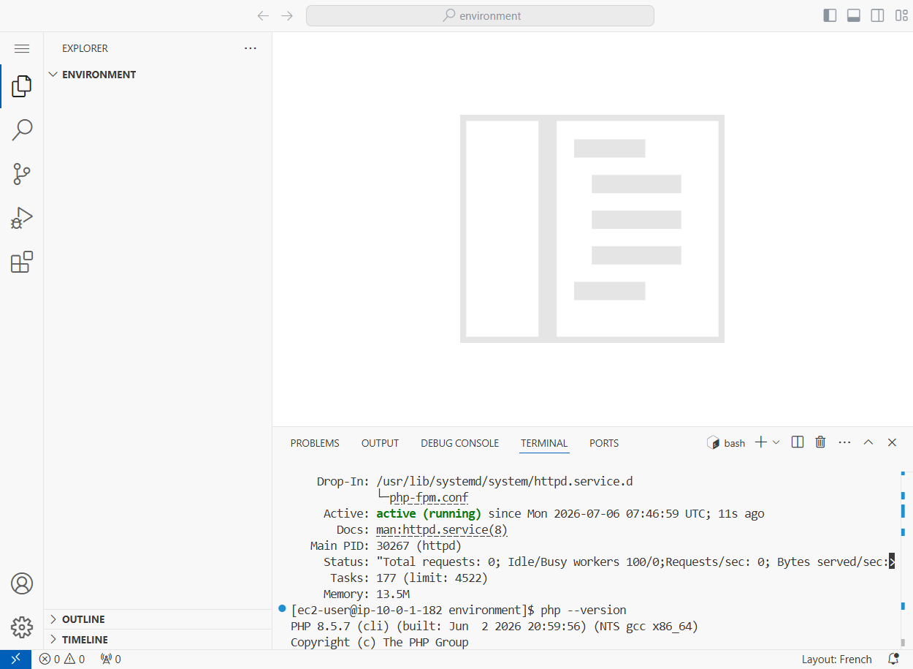
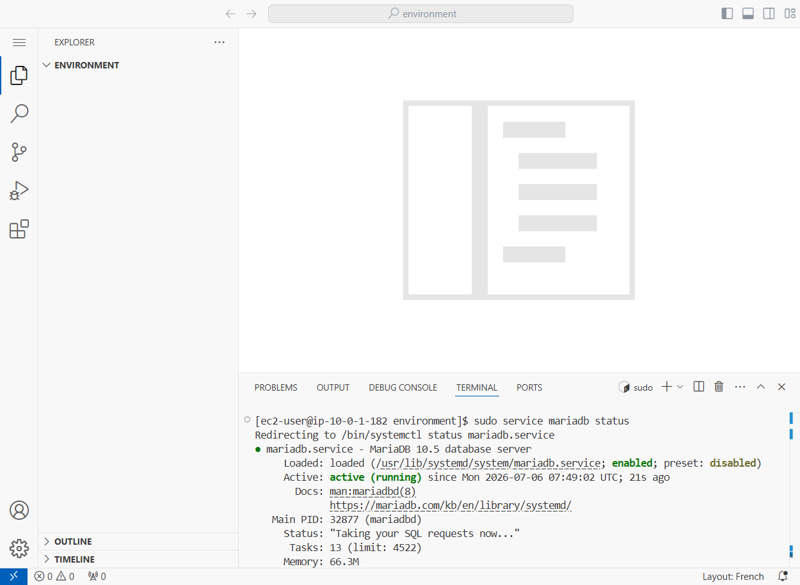
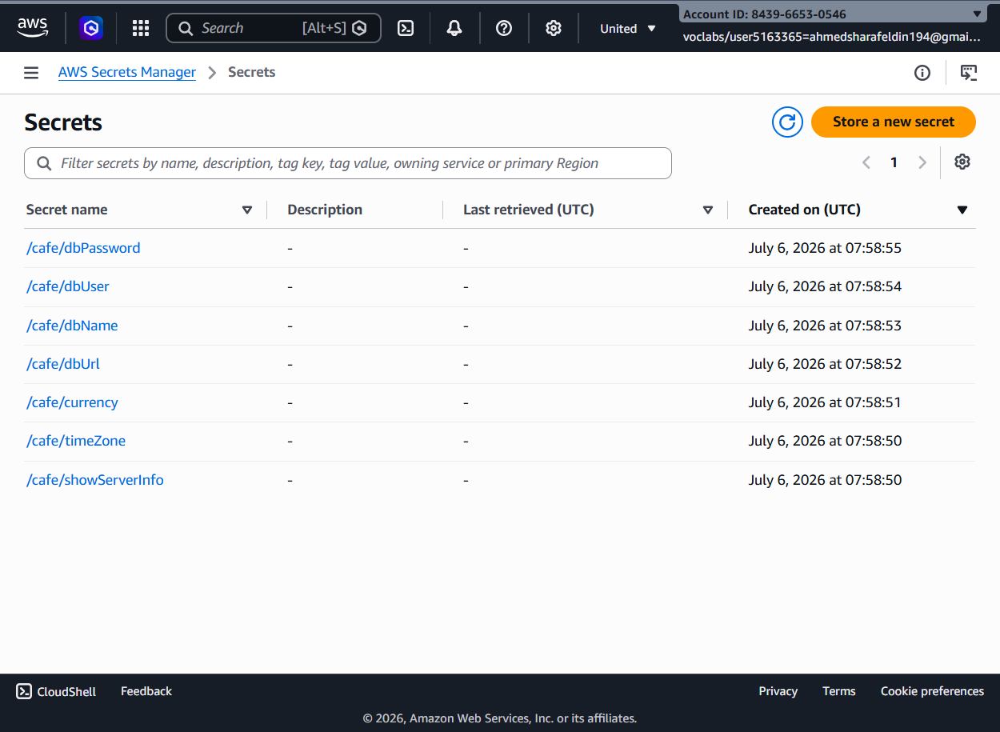
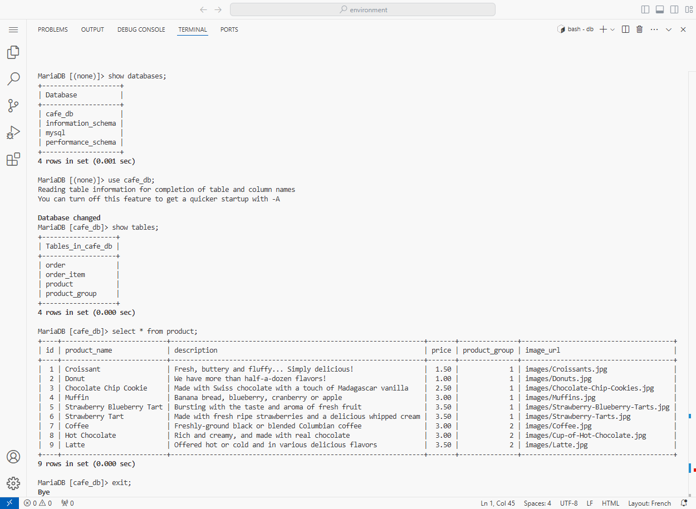
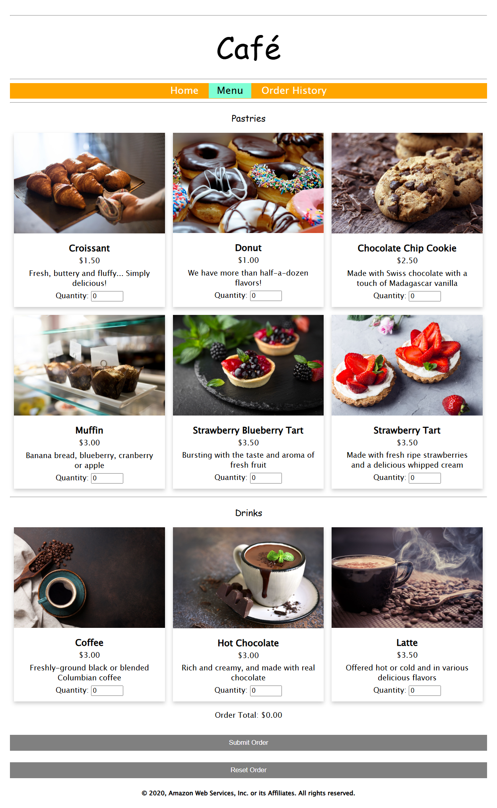
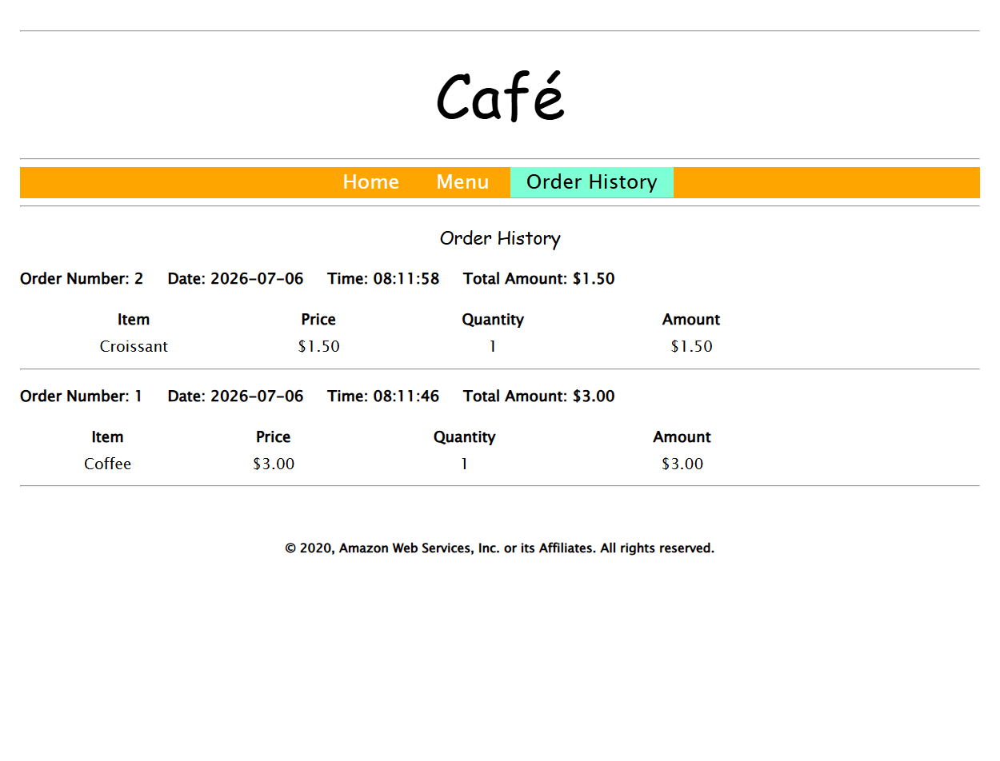
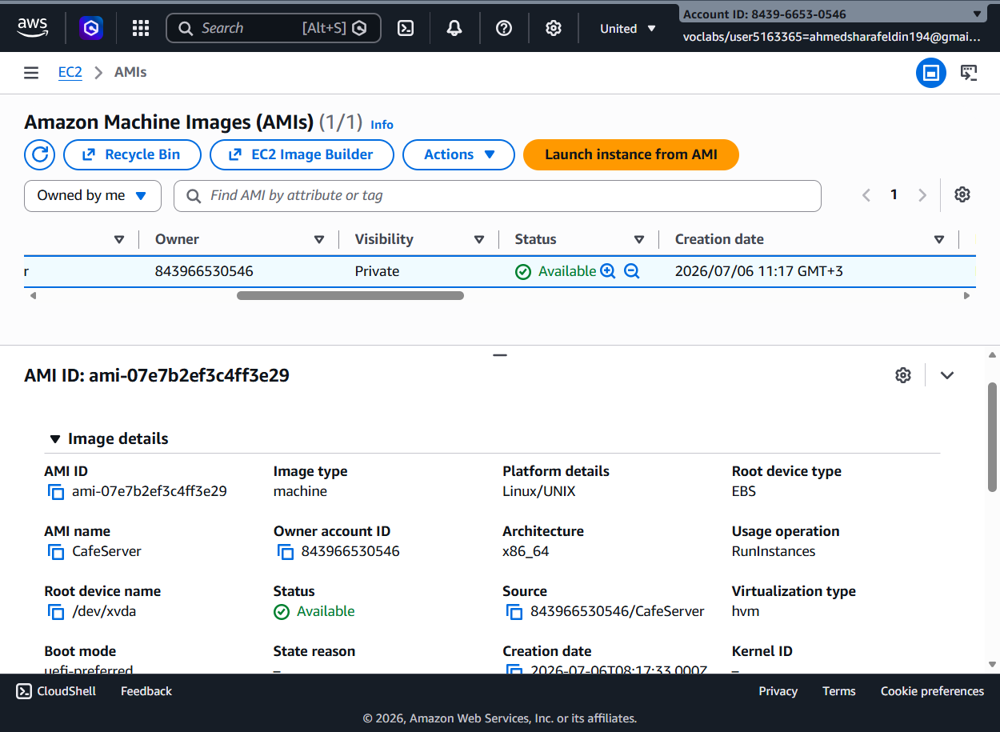

#  Deploying the Café Web Application

## 📖 Overview

In this lab, a complete Café web application was deployed on an Amazon EC2 instance. The application was configured with Apache HTTP Server, PHP, MariaDB, and AWS Secrets Manager. After deployment, the application was tested, connected to its database, and finally an Amazon Machine Image (AMI) was created for future deployments.

---

# 🏗️ AWS Services Used

- Amazon EC2
- Amazon VPC
- Security Groups
- AWS Secrets Manager
- Amazon Machine Image (AMI)
- Apache HTTP Server
- MariaDB
- PHP

---

# 🎯 Objectives

- Launch an EC2 instance
- Configure HTTP access
- Install Apache and PHP
- Deploy the Café application
- Store configuration in AWS Secrets Manager
- Verify database connectivity
- Test the web application
- Create a reusable AMI
- Launch a production server from the AMI

---

# 📝  Steps

## Step 1 — Launch EC2 Instance

A  IDE EC2 instance was launched successfully.

Instance Details:

- Instance Type: t3.medium
- Operating System: Amazon Linux
- Status: Running

---

## Step 2 — Configure Security Group

The inbound HTTP rule was configured to allow web traffic.

Configuration:

- Protocol: HTTP
- Port: 80
- Source: CloudFront Prefix List

This allows users to access the Café website securely.

---

## Step 3 — Access the Development Environment

The integrated development environment was opened through the Lab IDE.

The terminal was used to deploy and configure the application.

---

## Step 4 — Install and Verify Apache & PHP

Apache HTTP Server and PHP were installed and verified.

Validation commands included:

- `systemctl status httpd`
- `php --version`

Both services were successfully configured.

---

## Step 5 — Verify Web Server

The default web server page was accessed successfully from the browser.

This confirmed that Apache was serving web content correctly.

---

## Step 6 — Configure AWS Secrets Manager

Application configuration values were securely stored inside AWS Secrets Manager.

Secrets created included:

- dbUrl
- dbName
- dbUser
- dbPassword
- currency
- timeZone
- showServerInfo

---

## Step 7 — Verify Database

MariaDB was connected successfully.

Validation performed:

- List databases
- Select the café database
- Display tables
- Query product data

The Café database and sample records were verified.

---

## Step 8 — Test the Café Home Page

The deployed Café web application loaded successfully.

The homepage displayed:

- Navigation Menu
- Featured Products
- Contact Information
- Business Details

---

## Step 9 — Test the Menu Page

The menu page displayed all available products.

Features verified:

- Product Images
- Prices
- Quantity Selection
- Order Submission

---

## Step 10 — Verify Order History

Orders placed through the application were successfully stored in the database.

The Order History page displayed:

- Order Number
- Date
- Purchased Items
- Total Amount

---

## Step 11 — Create an Amazon Machine Image (AMI)

A reusable Amazon Machine Image was created from the configured EC2 instance.

AMI Details:

- Status: Available
- Platform: Linux
- Architecture: x86_64

This image can be used to launch identical servers in the future.

---

## Step 12 — Launch Production Instance

A new production EC2 instance was launched using the custom AMI.

This confirmed that the application could be replicated quickly using the created image.

---

# ✅ Results

The successfully demonstrated:

- EC2 Deployment
- HTTP Configuration
- Apache Installation
- PHP Installation
- AWS Secrets Manager Integration
- MariaDB Configuration
- Dynamic Web Application Deployment
- Database Connectivity
- Order Processing
- Custom AMI Creation
- Production Server Deployment

---

# 🔒 AWS Concepts Demonstrated

- Amazon EC2
- Security Groups
- Apache Web Server
- PHP Runtime
- MariaDB
- AWS Secrets Manager
- Application Configuration
- Amazon Machine Images (AMI)
- Infrastructure Reusability

---

# 🎓 Conclusion

This lab demonstrated how to deploy a complete web application on Amazon EC2, securely manage application configuration using AWS Secrets Manager, integrate with a MariaDB database, and create a reusable Amazon Machine Image (AMI). These services together provide a scalable, secure, and repeatable deployment workflow for production-ready web applications on AWS.
