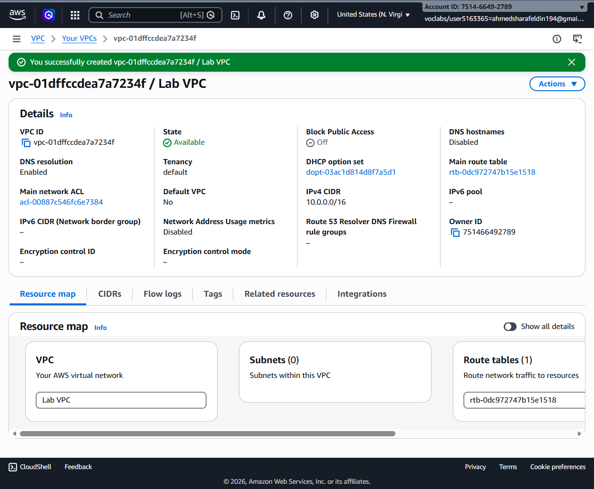
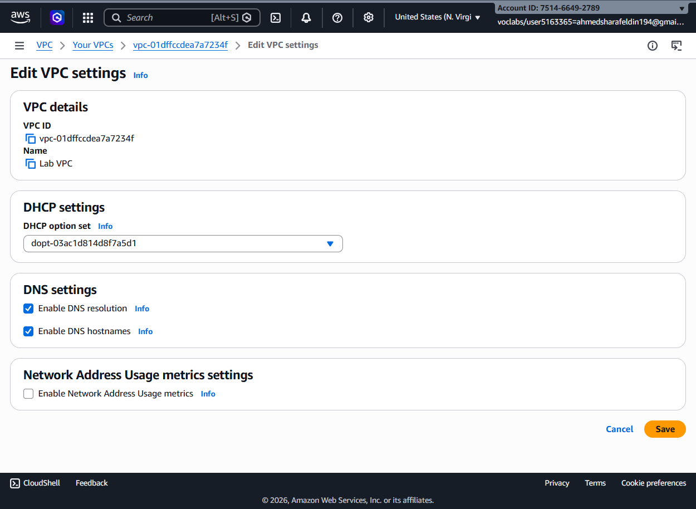
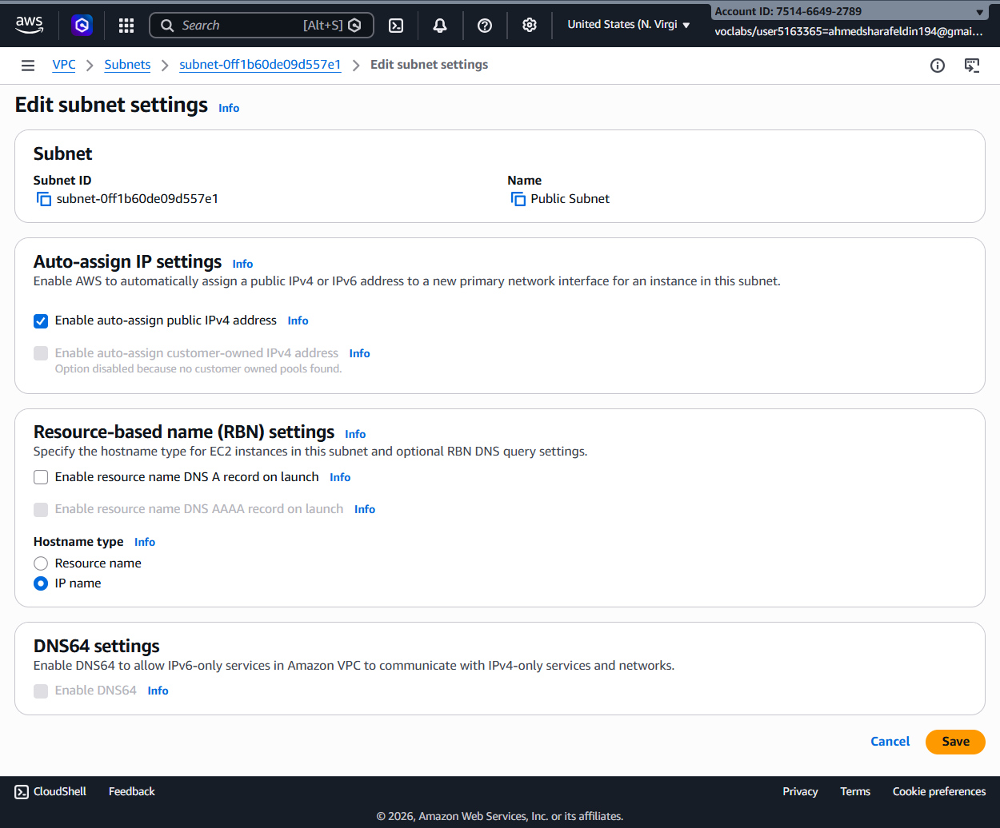
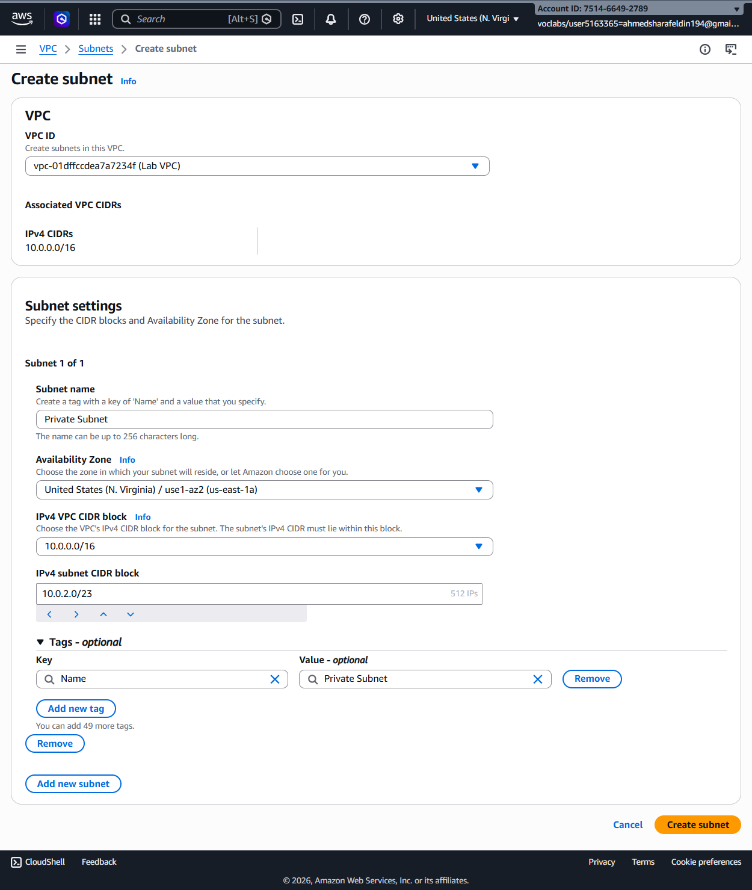
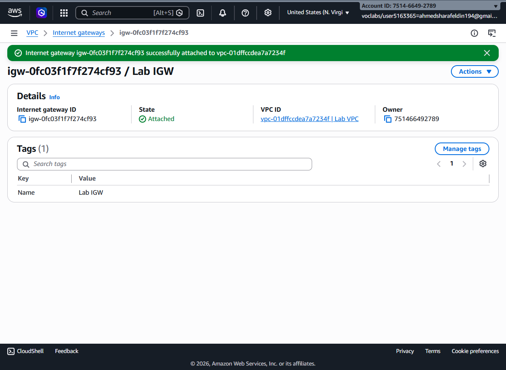
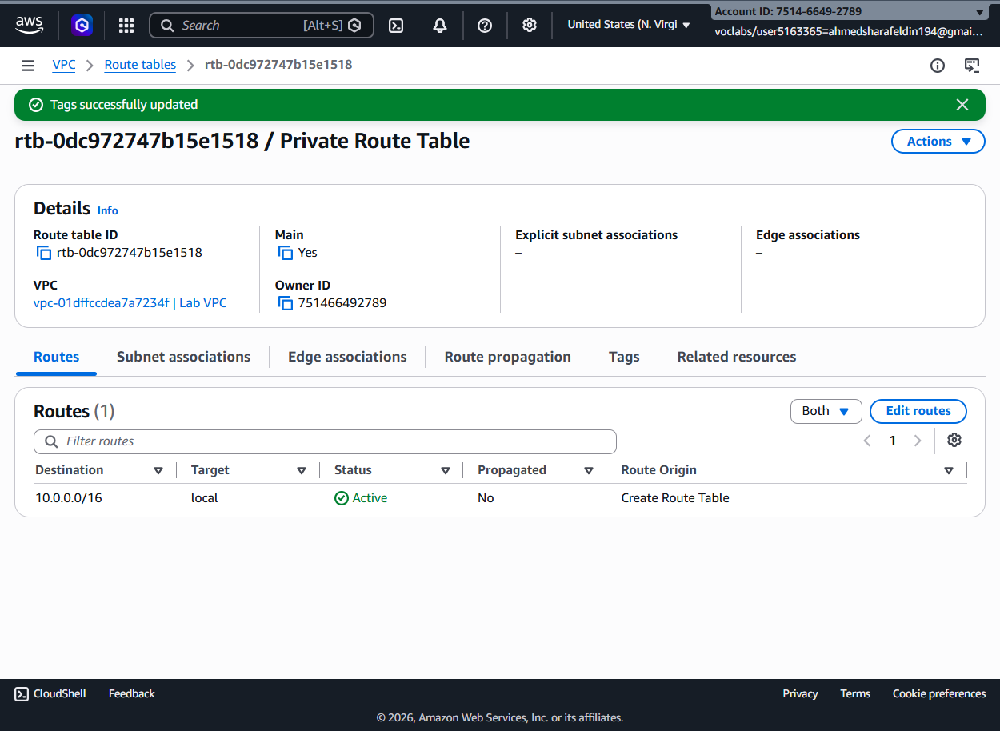
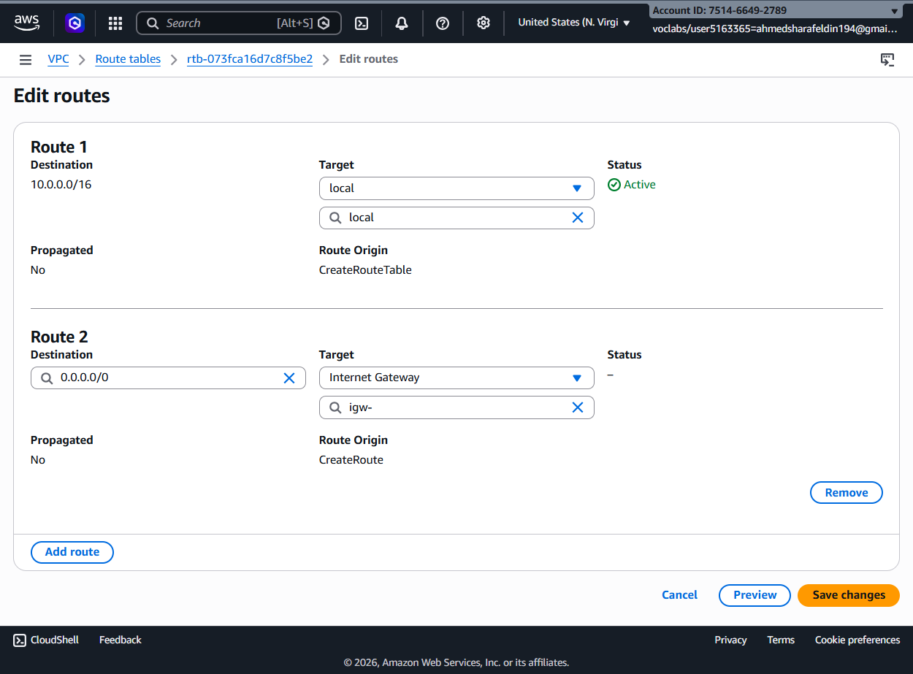
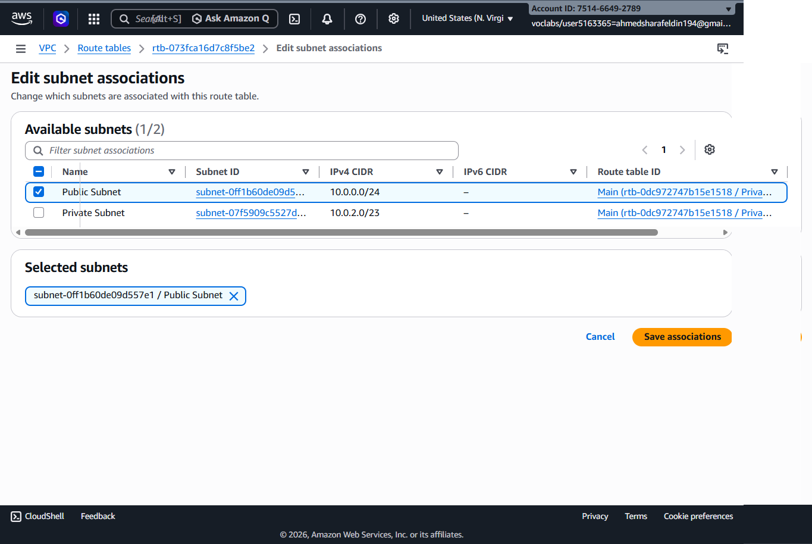
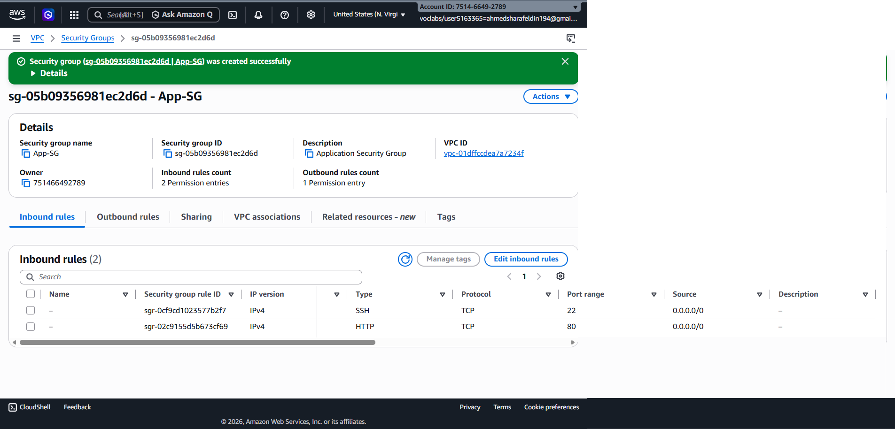
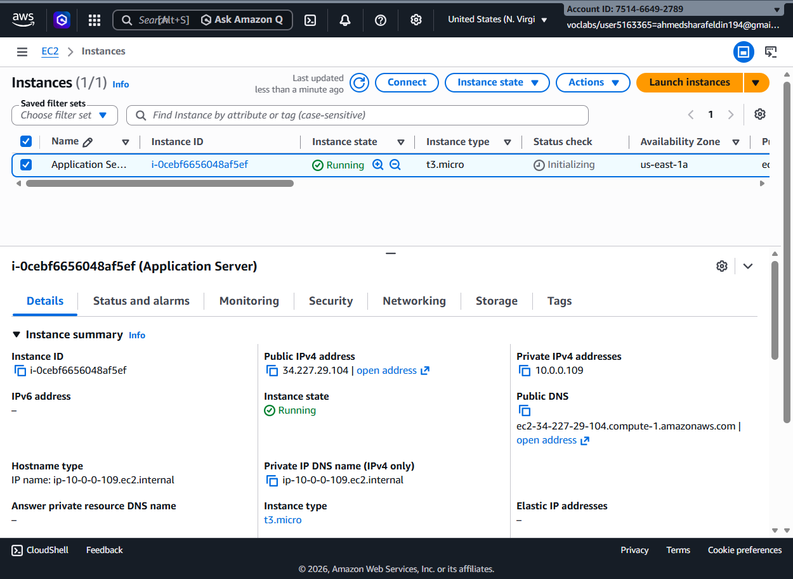

# 🌐 Building a Custom Amazon VPC for an Application Server

## 📖 Overview

This is demonstrates how to build a custom Amazon VPC from scratch, configure networking components, create public and private subnets, attach an Internet Gateway, configure route tables, create security groups, and finally deploy an EC2 application server inside the custom network.

---

# 🏗️ AWS Services Used

- Amazon VPC
- Amazon EC2
- Internet Gateway
- Route Tables
- Subnets
- Security Groups

---

# 🎯 Objectives

- Create a custom Amazon VPC
- Enable DNS support
- Configure Public and Private Subnets
- Attach an Internet Gateway
- Configure Route Tables
- Associate Public Subnet with Internet Access
- Create Security Groups
- Launch an EC2 Application Server

---

# 📝  Steps

## Step 1 — Create a Custom VPC

A new Virtual Private Cloud (VPC) was created using the required CIDR block to provide an isolated networking environment for the application infrastructure.

---

## Step 2 — Enable DNS Settings

The VPC settings were updated to enable:

- DNS Resolution
- DNS Hostnames

These settings allow EC2 instances to receive public DNS names and resolve domain names correctly.

---

## Step 3 — Configure the Public Subnet

The Public Subnet was configured to automatically assign a public IPv4 address to newly launched EC2 instances.

This allows instances inside the subnet to become directly accessible from the Internet.

---

## Step 4 — Create a Private Subnet

A Private Subnet was created using its own CIDR block inside the custom VPC.

The subnet provides a secure network for backend resources that should not be publicly accessible.

---

## Step 5 — Attach an Internet Gateway

An Internet Gateway (IGW) was created and attached to the custom VPC to provide Internet connectivity for resources located in the public subnet.

---

## Step 6 — Configure the Private Route Table

The route table associated with the VPC was reviewed and prepared for subnet associations.

Private networking routes remained local inside the VPC.

---

## Step 7 — Configure Public Routing

A default route (0.0.0.0/0) pointing to the Internet Gateway was added to the Public Route Table.

This enables outbound Internet connectivity for resources located in the public subnet.

---

## Step 8 — Associate the Public Subnet

The Public Subnet was associated with the Public Route Table so that it can use the Internet Gateway route.

---

## Step 9 — Create an Application Security Group

A dedicated Security Group was created for the application server.

Inbound rules included:

- SSH (22)
- HTTP (80)

These rules allow administrative access and web traffic.

---

## Step 10 — Launch the EC2 Application Server

An EC2 instance was launched inside the Public Subnet using the custom networking configuration.

The instance received:

- Public IPv4 Address
- Private IPv4 Address
- Public DNS Name

confirming successful deployment.

---

# ✅ Results

The lab successfully demonstrated:

- Custom Amazon VPC
- Public & Private Subnets
- DNS Configuration
- Internet Gateway
- Route Tables
- Route Associations
- Security Groups
- EC2 Deployment
- Public Internet Connectivity

---

# 🔒 AWS Concepts Demonstrated

- Amazon VPC
- CIDR Blocks
- Public Subnets
- Private Subnets
- Internet Gateway
- Route Tables
- Security Groups
- EC2 Networking
- DNS Resolution
- Public IPv4 Assignment

---

# 🎓 Conclusion

This lab demonstrated how to build a complete custom networking environment in AWS. A secure VPC architecture was created with separate public and private subnets, Internet connectivity was configured through an Internet Gateway and route tables, and an EC2 application server was successfully deployed using the custom infrastructure.