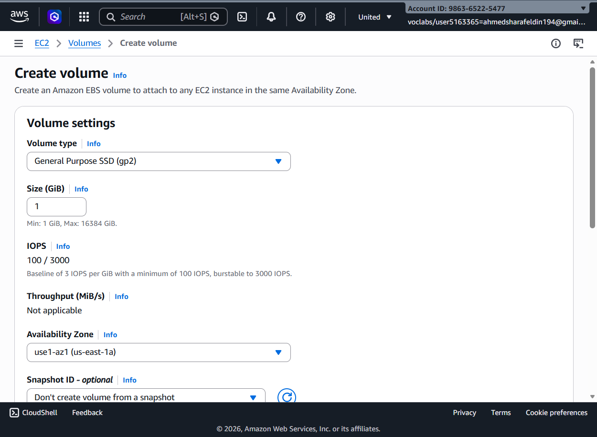
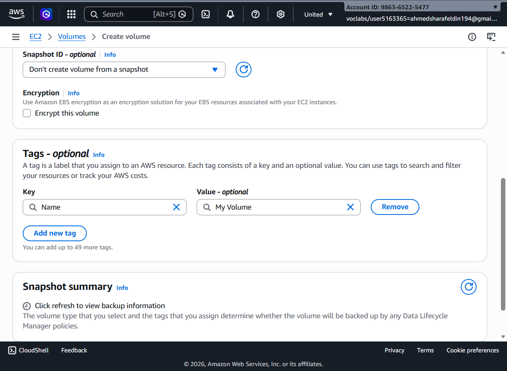
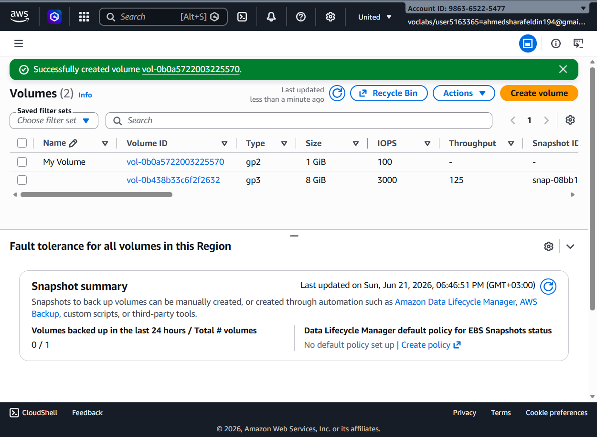
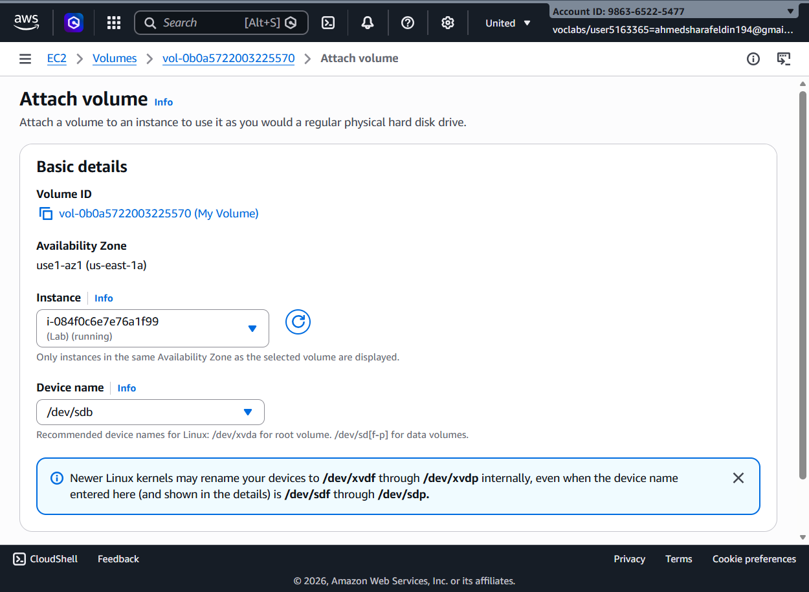
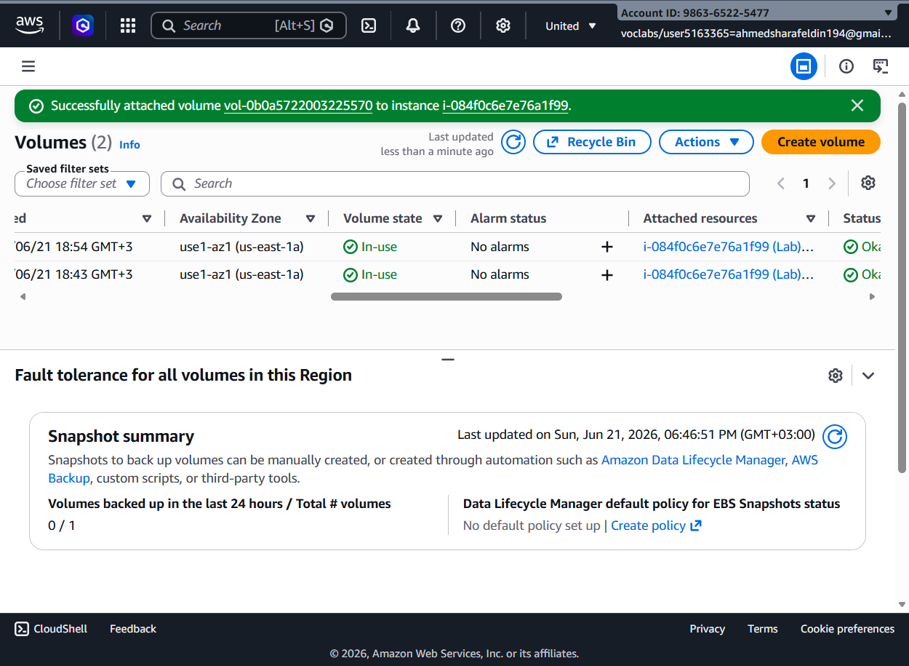
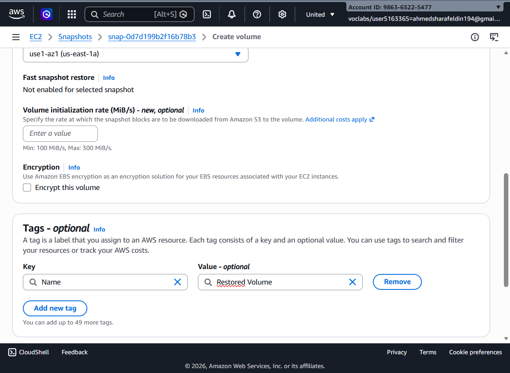

# AWS Academy Lab – Amazon EBS Volume Management

## Overview

This lab demonstrates how to manage Amazon Elastic Block Store (EBS) volumes with Amazon EC2.

The tasks include:

- Creating a new EBS volume
- Attaching the volume to an EC2 instance
- Formatting and mounting the volume
- Persisting storage using `/etc/fstab`
- Creating and restoring volumes from snapshots
- Verifying restored data

---

# Architecture

EC2 Instance
│
├── Root Volume (/)
│
├── EBS Volume
│ └── /mnt/data-store
│
└── Restored Snapshot Volume
└── /mnt/data-store2

---

# Step 1 – Create a New EBS Volume

A new EBS volume was created using the General Purpose SSD (gp2) storage type.

### Configuration

- Volume Type: gp2
- Size: 1 GiB
- Availability Zone: us-east-1a

### Screenshot



---

# Step 2 – Configure Volume Options

The volume configuration was reviewed and tagged for easier management.

### Tag

| Key | Value |
|------|---------|
| Name | My Volume |

### Screenshot



---

# Step 3 – Verify Volume Creation

AWS successfully created the new EBS volume.

### Result

- Volume State: Available
- Size: 1 GiB
- Type: gp2

### Screenshot



---

# Step 4 – Attach Volume to EC2

The created volume was attached to the running EC2 instance.

### Configuration

- Device Name: /dev/sdb
- Target Instance: Lab EC2 Instance

### Screenshot



---

# Step 5 – Verify Volume Attachment

The attachment operation completed successfully.

### Result

- Volume State: In-use
- Attached to EC2 Instance

### Screenshot



---

# Step 6 – Restore Volume from Snapshot

A new volume was created from an existing EBS snapshot.

### Purpose

Restore previously stored data from backup storage.

### Screenshot



---

# Step 7 – Format and Mount the Volume

The newly attached volume was formatted and mounted.

### Commands

```bash
sudo mkfs -t ext3 /dev/sdb

sudo mkdir /mnt/data-store

sudo mount /dev/sdb /mnt/data-store

sudo blkid