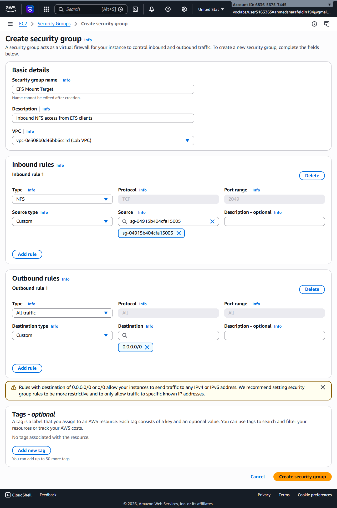
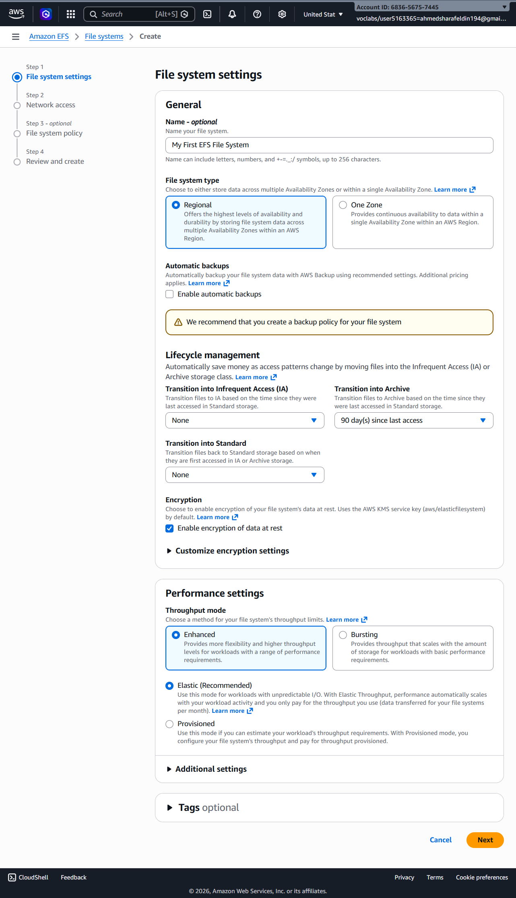
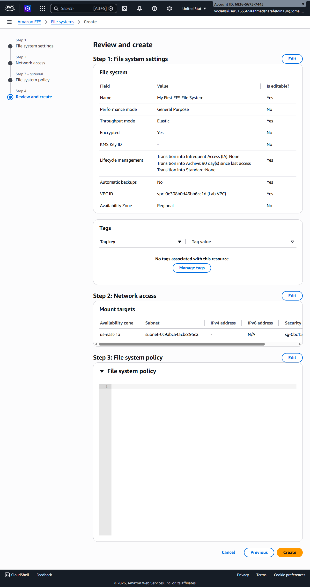
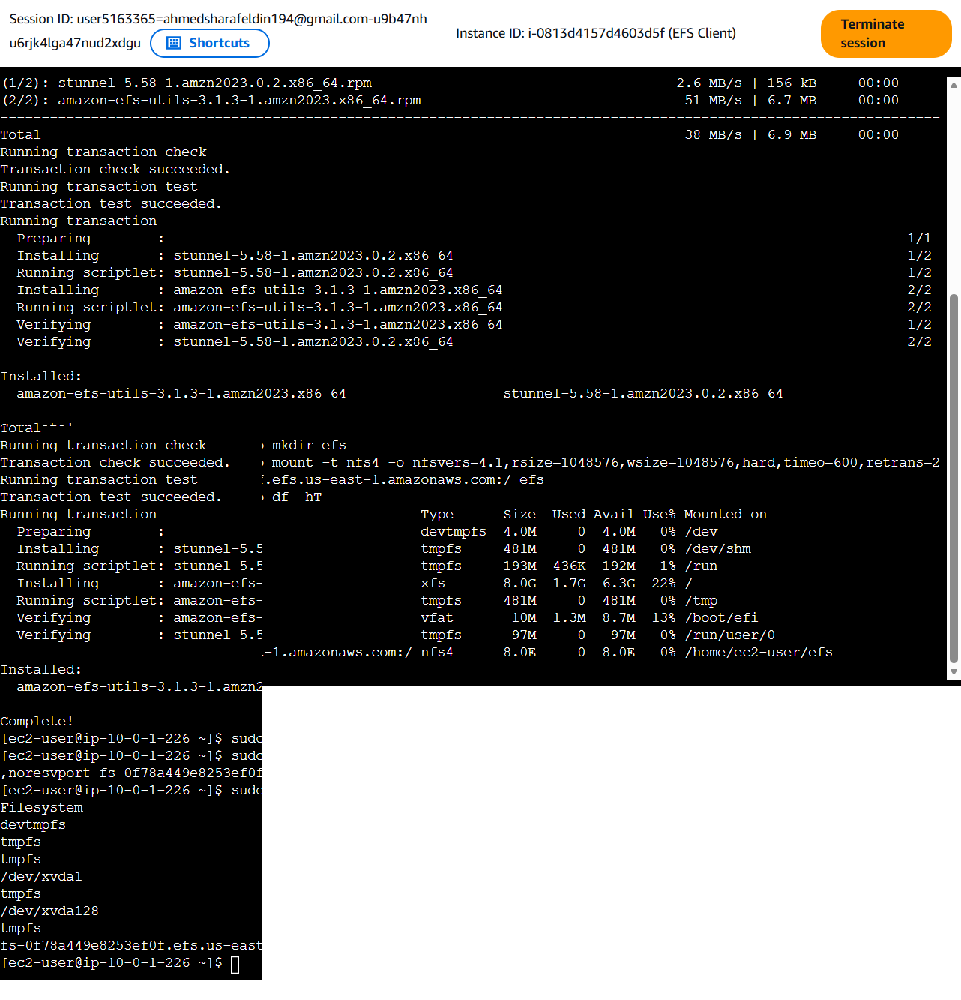
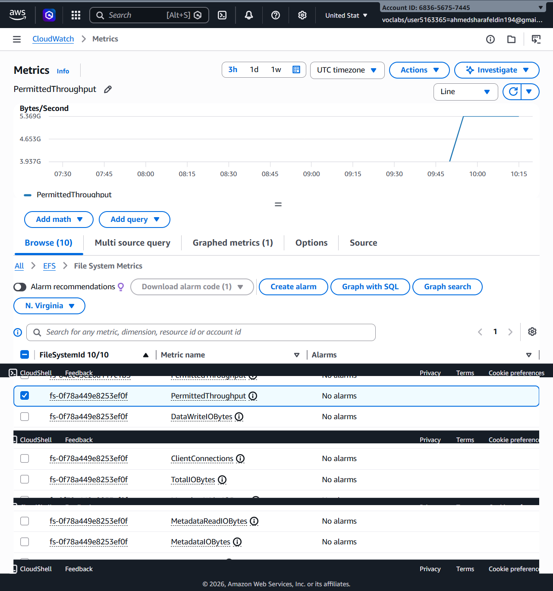
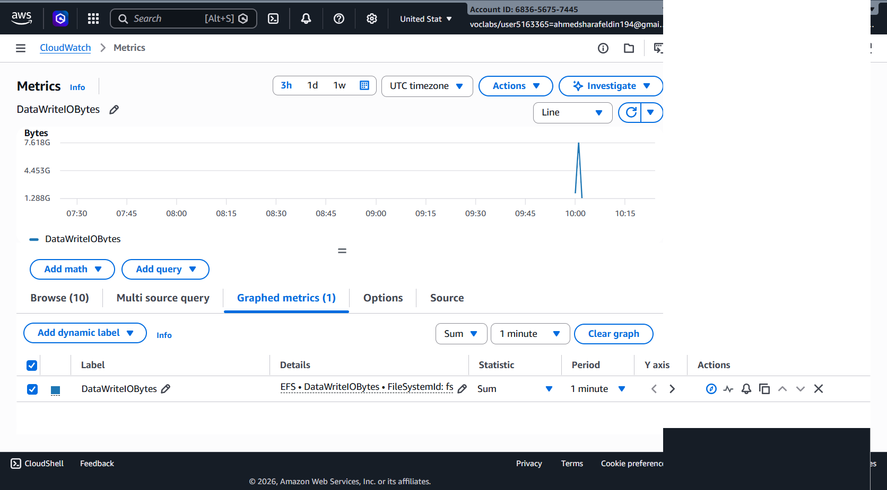

# ☁️ AWS Academy Lab - Amazon Elastic File System (EFS)

## 📖 Overview

This lab demonstrates how to create and configure an Amazon Elastic File System (EFS), securely connect it to an EC2 instance, mount the shared file system using NFS, and monitor its performance through Amazon CloudWatch.

---

# 🏗️ AWS Services Used

- Amazon EFS
- Amazon EC2
- Amazon VPC
- Security Groups
- Amazon CloudWatch

---

# 🎯 Objectives

- Create an Amazon EFS File System
- Configure Security Groups
- Configure Mount Targets
- Mount EFS on an EC2 Instance
- Verify Shared Storage
- Monitor EFS Performance using CloudWatch

---

# 📝 Lab Steps

## Step 1 — Create Security Group

A dedicated security group was created for the EFS Mount Target.

Configuration:

- Security Group Name: **EFS Mount Target**
- Inbound Rule:
  - NFS (TCP Port 2049)
  - Source: EC2 Security Group
- Outbound Rule:
  - Allow All Traffic

---

## Step 2 — Create Amazon EFS File System

A new Amazon EFS file system was configured.

Configuration:

- Regional File System
- Encryption Enabled
- Elastic Throughput
- Archive after 90 Days
- Automatic Backups Disabled

---

## Step 3 — Review and Create

The EFS configuration was reviewed before deployment.

The review included:

- File System Settings
- Mount Target
- Network Access
- File System Policy

---

## Step 4 — Mount the File System on EC2

The Amazon EFS utilities were installed on the EC2 instance.

Commands executed included:

- Install amazon-efs-utils
- Create mount directory
- Mount the EFS File System
- Verify mount using `df -hT`

The mounted EFS storage appeared successfully on the EC2 instance.

---

## Step 5 — Monitor Amazon EFS Metrics

Amazon CloudWatch was used to monitor the EFS file system.

Metrics observed included:

- PermittedThroughput
- ClientConnections
- DataWriteIOBytes
- TotalIOBytes
- MetadataReadIOBytes
- MetadataIOBytes

---

## Step 6 — Verify Write Activity

CloudWatch displayed write activity generated after writing data to the mounted EFS file system.

The **DataWriteIOBytes** metric confirmed successful file operations.

---

# ✅ Results

The lab successfully demonstrated:

- Amazon EFS Creation
- Secure Network Configuration
- Mount Target Configuration
- EC2 Integration
- Shared File Storage
- NFS Mounting
- CloudWatch Monitoring
- Performance Metrics

---

# 🔒 AWS Concepts Demonstrated

- Amazon Elastic File System (EFS)
- Network File System (NFS)
- Security Groups
- Mount Targets
- Shared Storage
- Elastic Throughput
- Data Encryption
- Amazon CloudWatch Monitoring

---

# 🎓 Conclusion

Amazon Elastic File System (EFS) provides scalable, highly available, and fully managed shared file storage for Amazon EC2 instances. By integrating EFS with Security Groups, Mount Targets, and CloudWatch, organizations can build reliable shared storage solutions while continuously monitoring storage performance and usage.