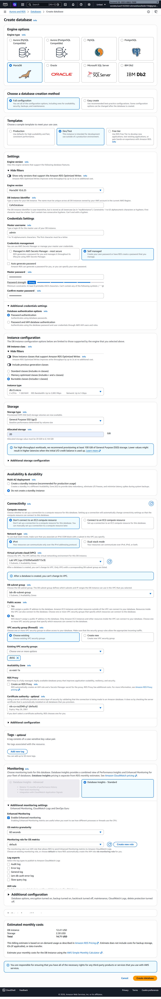
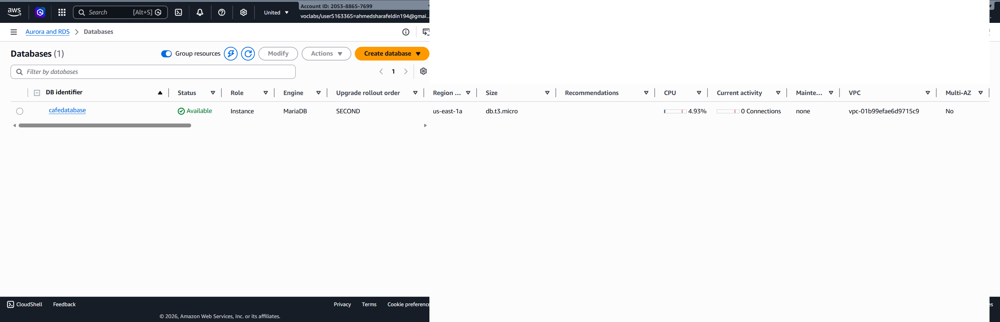
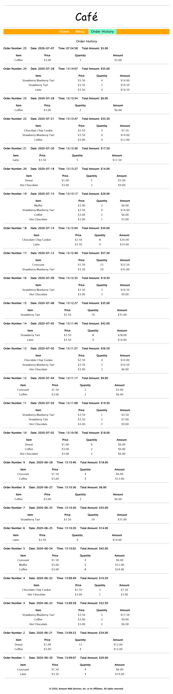
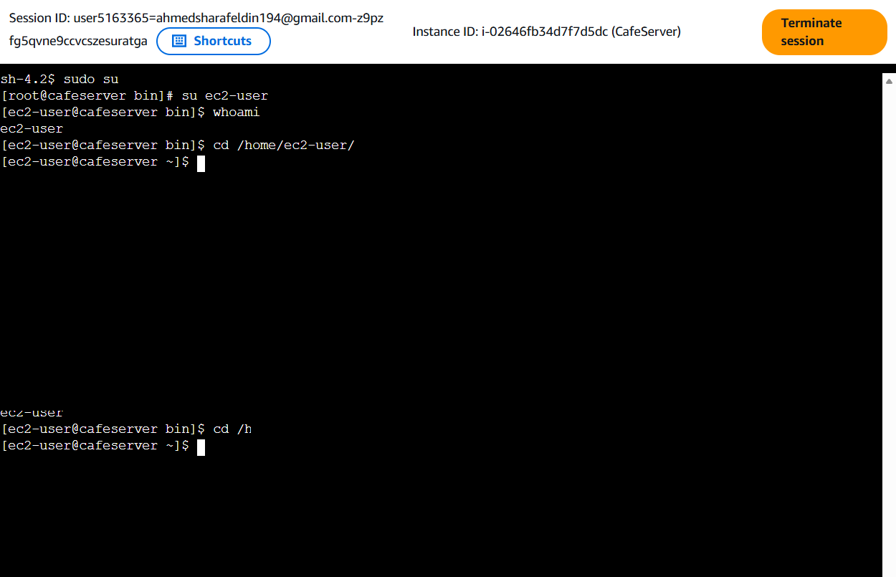
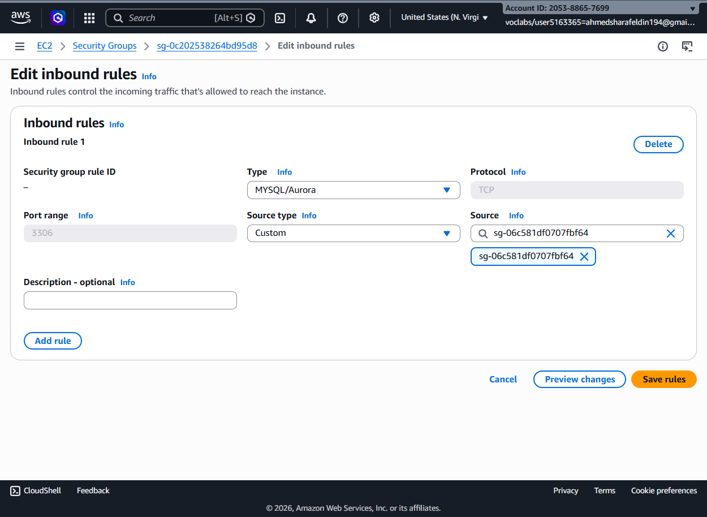

# ☕  - Deploying a Café Application with Amazon RDS MariaDB

## 📖 Overview

In this , a MariaDB database was deployed using Amazon RDS and integrated with the Café web application hosted on Amazon EC2. The database was configured inside a secure Amazon VPC, appropriate security group rules were created, and the application was tested to verify successful communication with the database.

---

# 🏗️ AWS Services Used

- Amazon RDS
- Amazon EC2
- Amazon VPC
- Security Groups
- MariaDB
- MySQL Client

---

# 🎯 Objectives

- Deploy an Amazon RDS MariaDB instance
- Configure secure database networking
- Allow EC2 access to the database
- Verify successful database deployment
- Connect the Café web application to Amazon RDS
- Test application functionality
- Verify order history stored inside the database

---

# 📝  Steps

## Step 1 — Create an Amazon RDS MariaDB Database

A new Amazon RDS database was created using MariaDB.

Configuration included:

- Engine: MariaDB
- Template: Dev/Test
- Instance Class: db.t3.micro
- Allocated Storage
- Master Credentials
- VPC Configuration
- Security Groups

---

## Step 2 — Verify Database Creation

After deployment completed, the database status changed to **Available**, indicating the database instance was successfully provisioned.

Verified information included:

- DB Identifier
- Engine
- Instance Class
- Availability Zone
- Database Status

---

## Step 3 — Configure Database Security Group

An inbound rule was added to the RDS security group.

Configuration:

- Type: MySQL / Aurora
- Port: 3306
- Source: EC2 Security Group

This allows only the Café EC2 instance to communicate with the database securely.

---

## Step 4 — Access the EC2 Instance

The EC2 instance hosting the Café application was accessed through the terminal.

Basic verification commands were executed to confirm the active user and working directory before continuing with the application deployment.

---

## Step 5 — Test the Café Application

The Café web application successfully loaded after the database connection was established.

The application displayed:

- Home Page
- Product Information
- Navigation Menu
- Contact Information

This confirmed successful communication between the application server and Amazon RDS.

---

## Step 6 — Verify Database Records

The Order History page displayed historical customer orders retrieved directly from the MariaDB database.

Displayed information included:

- Order Number
- Date
- Ordered Items
- Quantity
- Total Amount

This verified that the application was successfully reading data stored in Amazon RDS.

---

# ✅ Results

 successfully demonstrated:

- Amazon RDS MariaDB Deployment
- Secure Database Configuration
- VPC Networking
- Security Group Configuration
- EC2 to RDS Connectivity
- Database Access Control
- Café Web Application Integration
- Retrieval of Persistent Database Records

---

# 🔒 AWS Concepts Demonstrated

- Amazon RDS
- MariaDB
- Amazon EC2
- Amazon VPC
- Security Groups
- Relational Databases
- Private Networking
- Database Connectivity
- Client-Server Architecture

---

# 🎓 Conclusion

This lab demonstrated how to deploy an Amazon RDS MariaDB database and securely integrate it with a web application running on Amazon EC2. By configuring VPC networking and security groups correctly, the application was able to communicate with the managed database service and retrieve persistent customer order data.