# 🚀  Auto Scaling, Load Balancer & CloudWatch

## 📖 Overview

This lab demonstrates how to build a highly available and scalable web application architecture using AWS services. The implementation includes Launch Templates, Auto Scaling Groups, Target Groups, Application Load Balancers, CloudWatch monitoring, and EC2 instance recovery.

---

# 🏗️ AWS Services Used

- Amazon EC2
- Amazon EC2 Auto Scaling
- Application Load Balancer (ALB)
- Target Groups
- Amazon CloudWatch
- Amazon VPC

---

# 📝  Implementation

## Step 1 — Create Launch Template

A launch template was created to define the EC2 instance configuration used by Auto Scaling.

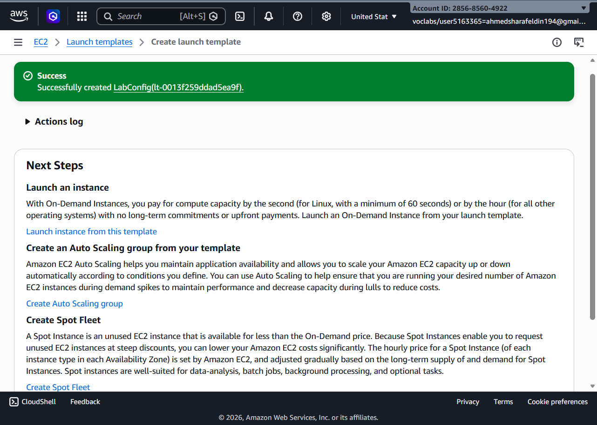

---

## Step 2 — Create Auto Scaling Group

The Auto Scaling Group was created using the launch template.

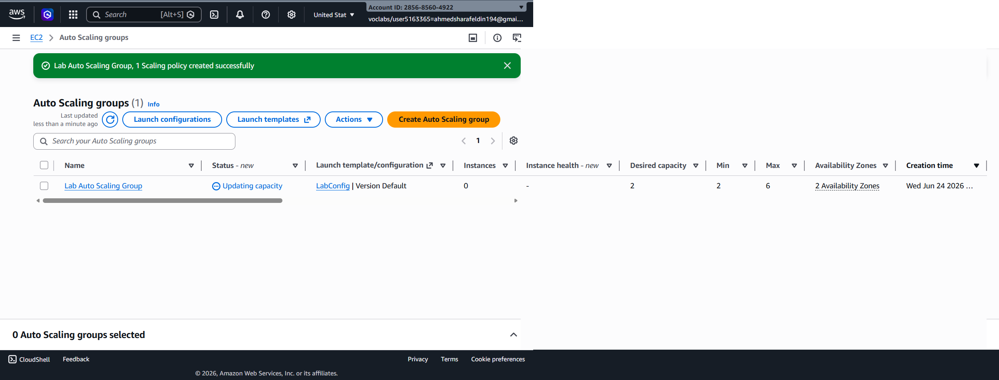

---

## Step 3 — Verify Auto Scaling Configuration

The Auto Scaling Group was successfully deployed with the desired capacity.

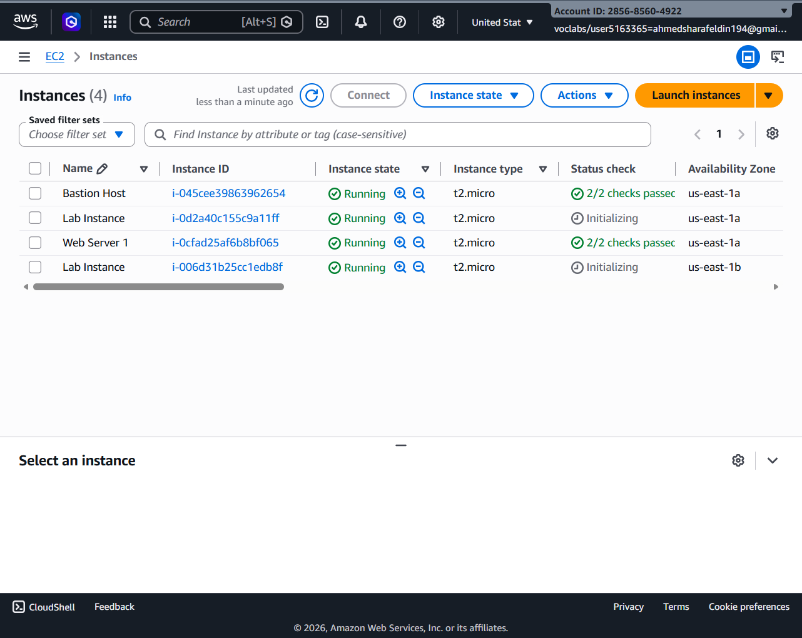

---

## Step 4 — Create Target Group

A target group was created to manage backend EC2 instances.

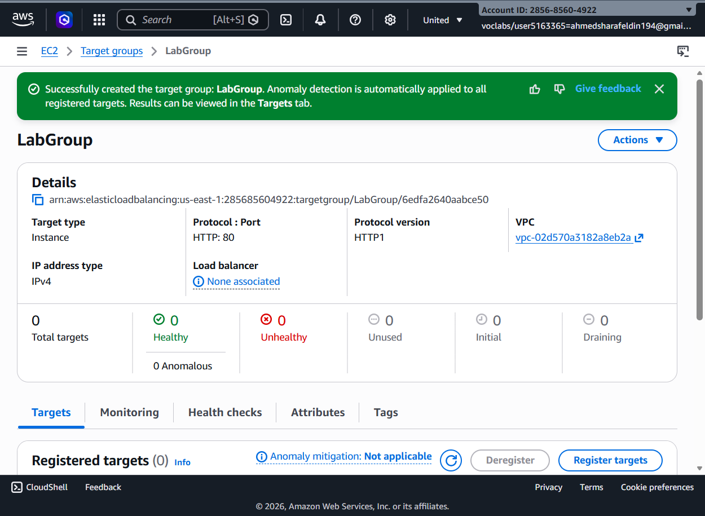

---

## Step 5 — Create Application Load Balancer

An internet-facing Application Load Balancer (ALB) was created.

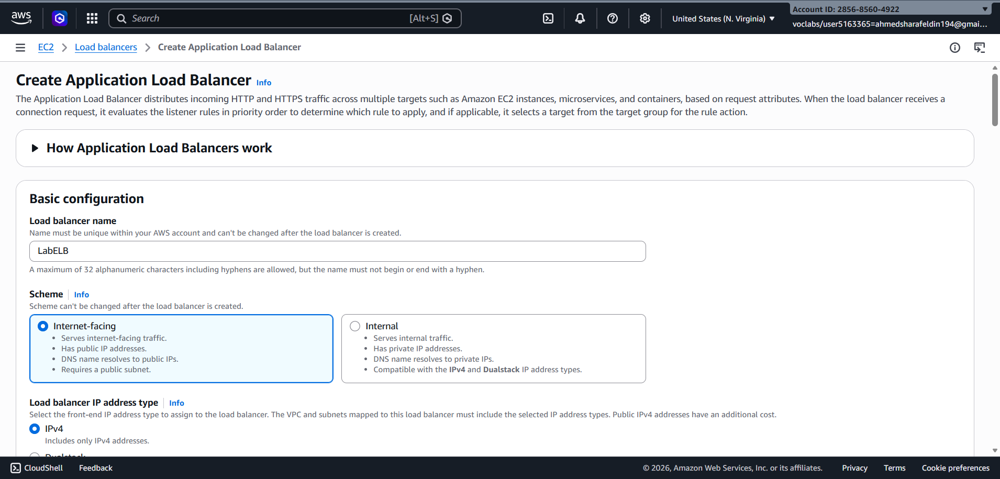

---

## Step 6 — Configure Availability Zones & Subnets

Public subnets across multiple Availability Zones were selected to improve fault tolerance.

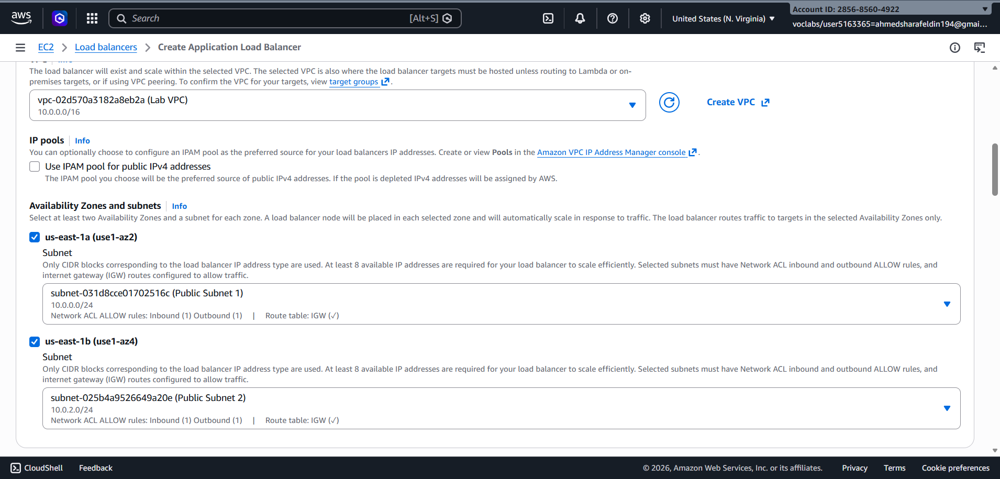

---

## Step 7 — Register EC2 Targets

EC2 instances were added to the target group.

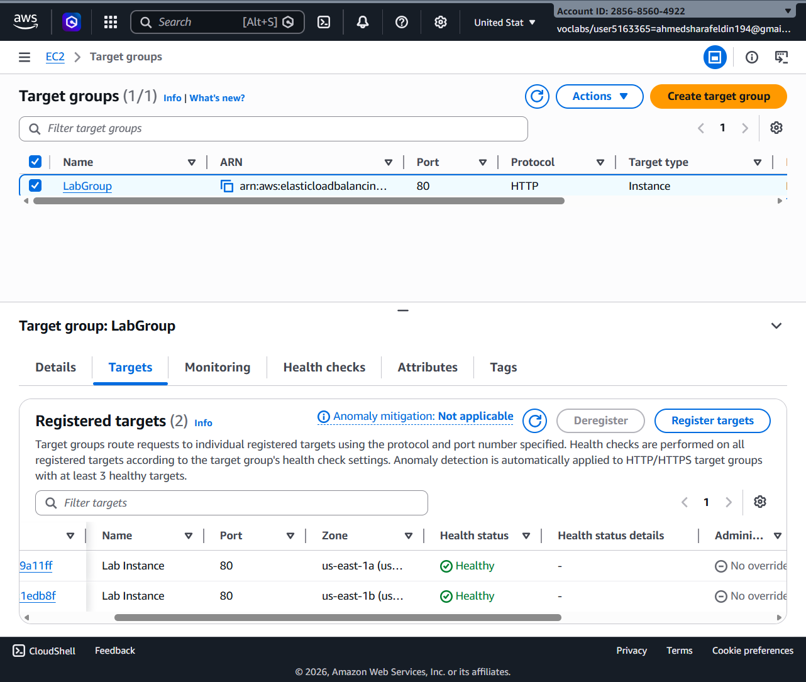

---

## Step 8 — Verify Target Health

AWS successfully validated the registered targets as healthy.

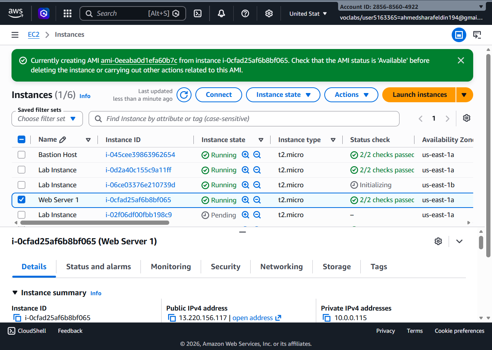

---

## Step 9 — Verify Running Instances

Multiple EC2 instances were launched and running correctly.

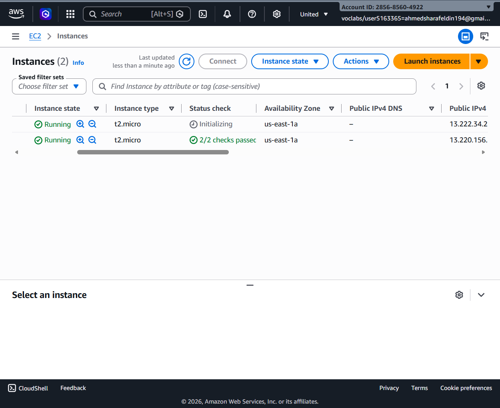

---

## Step 10 — Monitor Web Server Instance

The Web Server instance was verified and monitored.

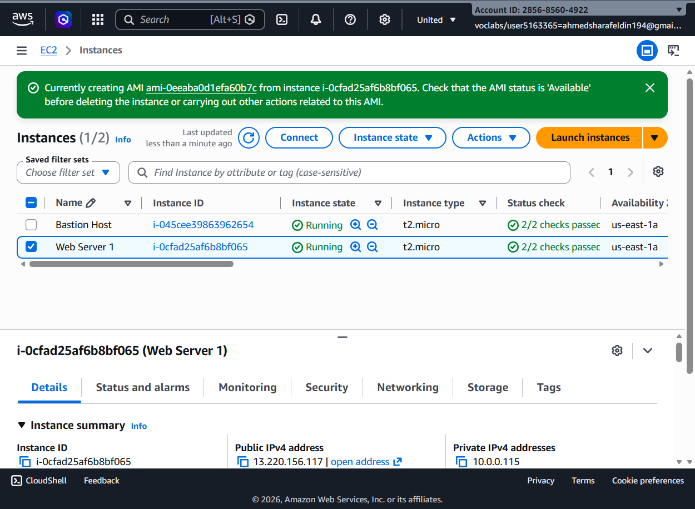

---

## Step 11 — Scale Out Event

Additional EC2 instances were automatically launched by Auto Scaling.

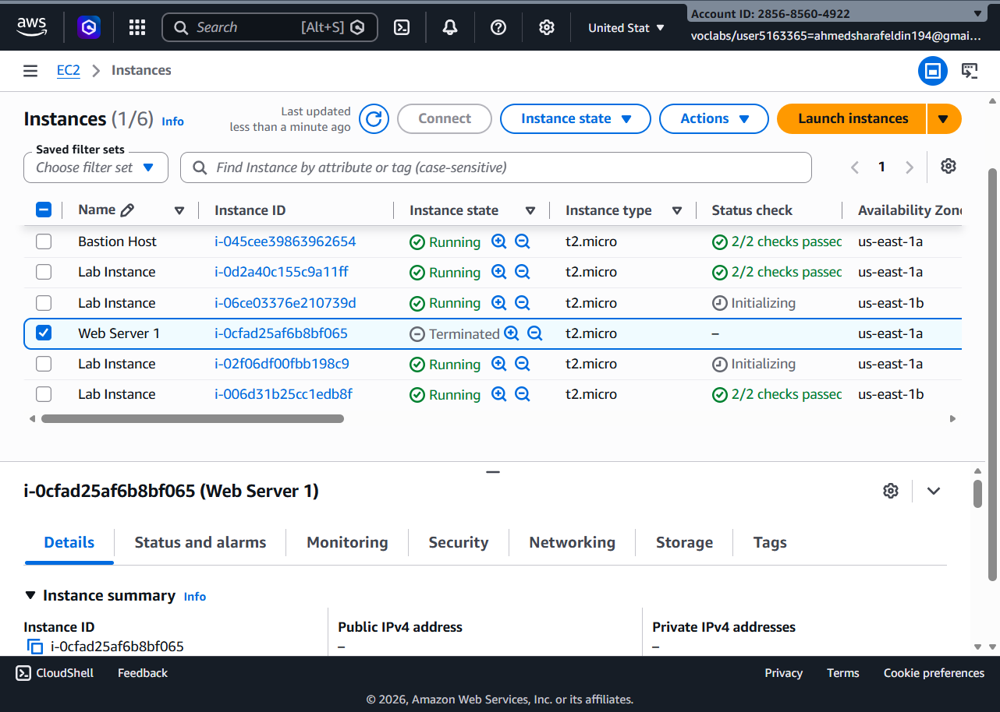

---

## Step 12 — Instance Failure Simulation

An EC2 instance was terminated to test Auto Scaling recovery.

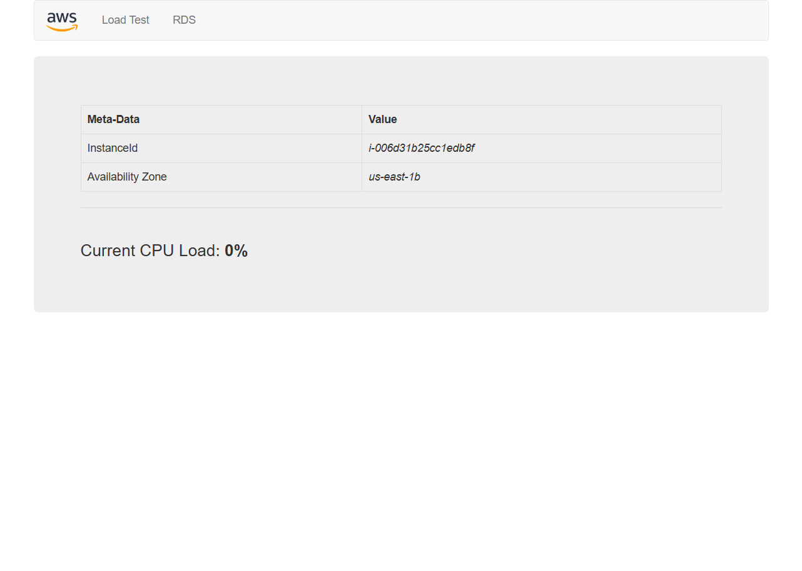

---

## Step 13 — CloudWatch Monitoring

CloudWatch alarms were used to monitor scaling activities and instance health.

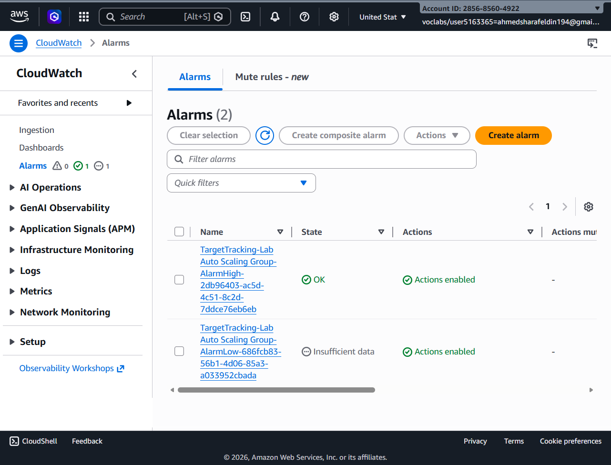

---

# ✅ Results

The lab successfully demonstrated:

- Launch Template creation
- Auto Scaling Group deployment
- Automatic EC2 scaling
- Load Balancer configuration
- Target Group management
- Health Check validation
- CloudWatch monitoring
- High Availability architecture
- Automatic recovery after instance termination

---

# 🎯 Conclusion

This lab illustrates how AWS Auto Scaling and Load Balancing services work together to maintain application availability, distribute traffic efficiently, and automatically recover from infrastructure failures. CloudWatch provides visibility into system health and scaling events, enabling reliable and resilient cloud deployments.
