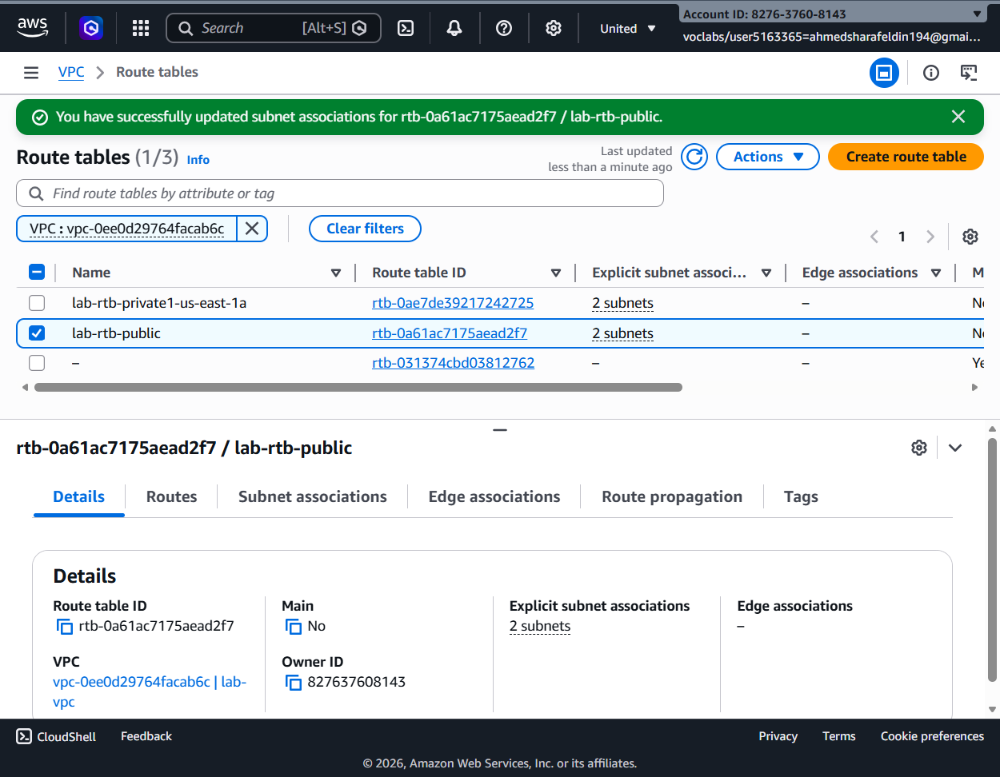
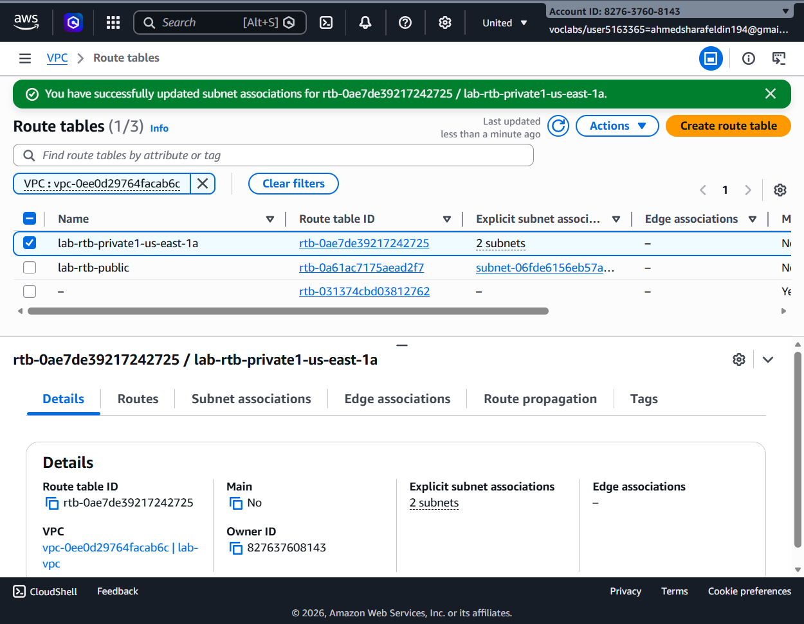
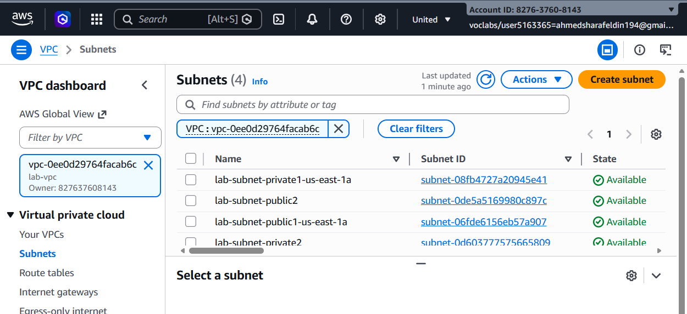
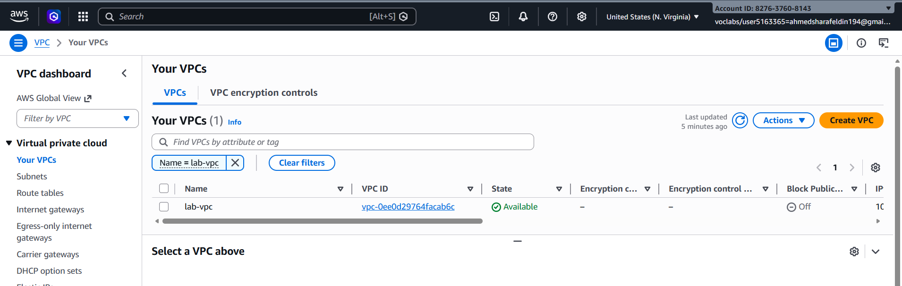
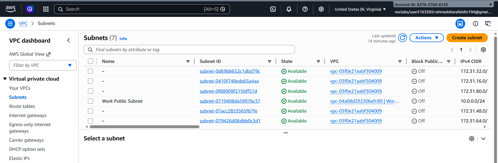
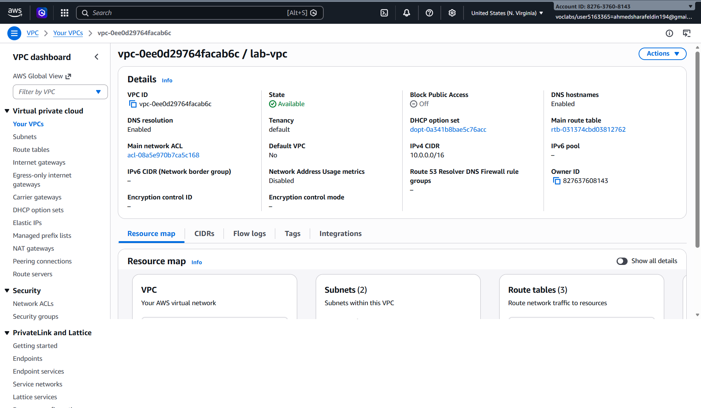
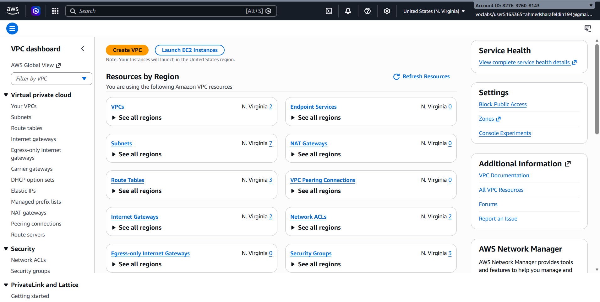
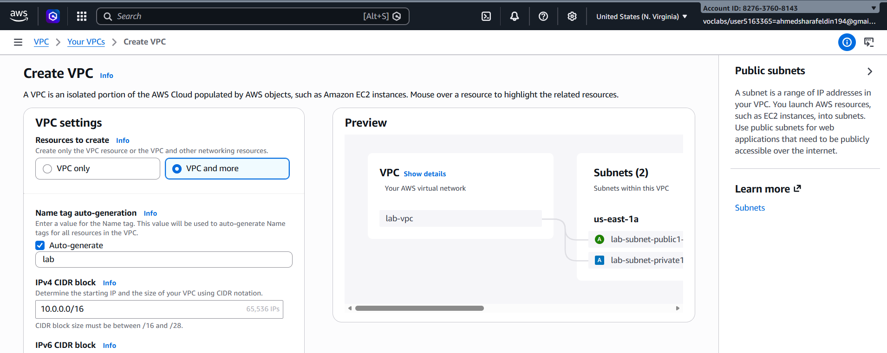
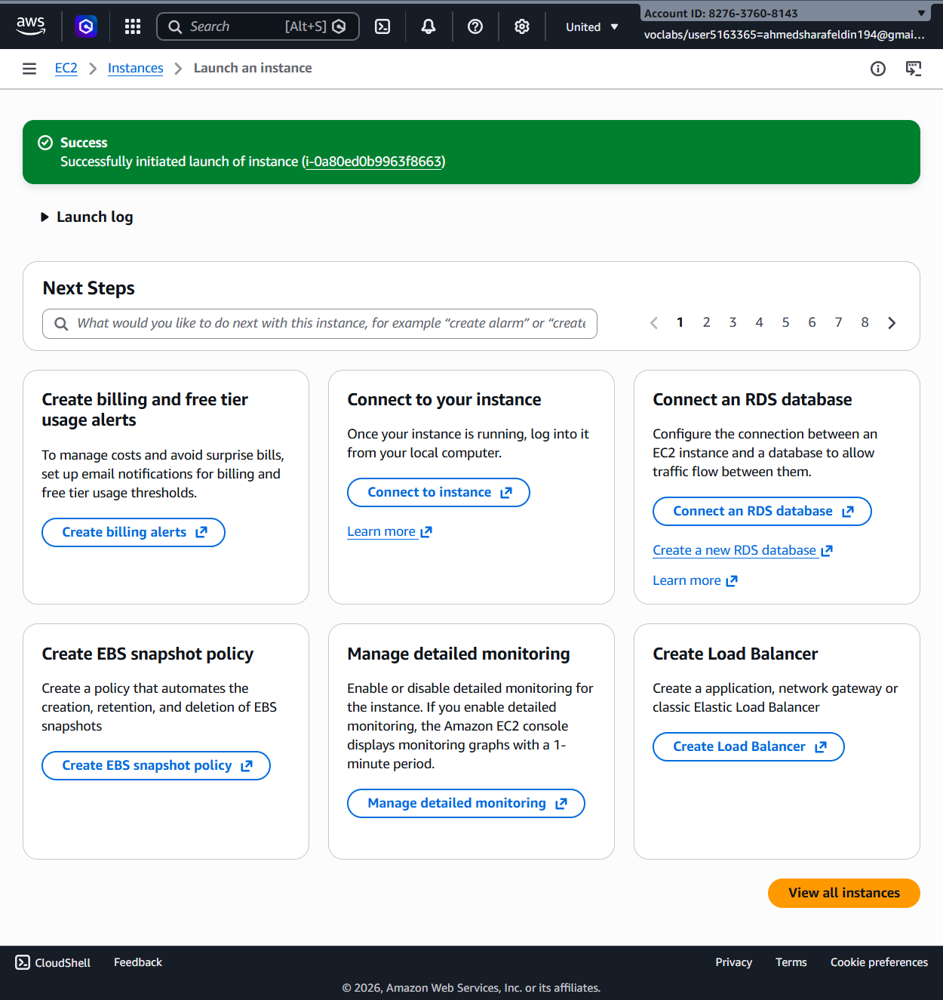
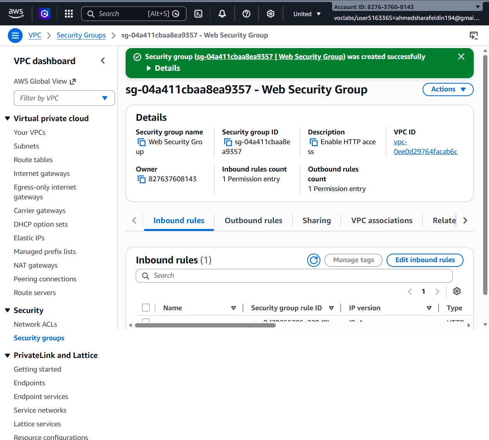

# AWS VPC Architecture Lab

## Overview

This lab demonstrates the creation and configuration of a custom Amazon Virtual Private Cloud (VPC) environment.

The objective was to build a secure and scalable network architecture consisting of custom subnets, route tables, security groups, and EC2 resources.

---

# Lab Objectives

- Create a custom VPC.
- Configure public and private subnets.
- Associate route tables with subnets.
- Create security groups.
- Launch EC2 instances inside the VPC.
- Validate network resource deployment.

---

# Step 1 – Access VPC Dashboard

The Amazon VPC Dashboard was used as the starting point for managing networking resources.

## Screenshot

---

# Step 2 – Create Custom VPC

A new Virtual Private Cloud was created using the VPC and More option.

## Configuration

| Setting | Value |
|----------|---------|
| VPC Name | lab-vpc |
| CIDR Block | 10.0.0.0/16 |

## Screenshot

---

# Step 3 – Verify VPC Creation

The newly created VPC was verified from the VPC console.

## Screenshot

## Result

- VPC successfully created.
- CIDR block configured correctly.
- DNS Hostnames enabled.
- DNS Resolution enabled.

---

# Step 4 – Create Public Subnet

A public subnet was created inside the custom VPC.

## Configuration

| Setting | Value |
|----------|---------|
| Subnet Name | lab-subnet-public2 |
| Availability Zone | us-east-1b |
| CIDR Block | 10.0.2.0/24 |

## Screenshot

---

# Step 5 – Verify Public Subnet Creation

The subnet creation process completed successfully.

## Screenshot

## Result

The subnet was created and became available for resource deployment.

---

# Step 6 – Review Subnets

All subnets inside the VPC were reviewed.

## Screenshot

## Result

The VPC contains:

- Public Subnet
- Additional Public Subnet
- Private Subnet
- Additional Private Subnet

---

# Step 7 – Associate Public Route Table

The public route table was associated with the public subnets.

## Screenshot

## Result

Traffic from public subnets can be routed through the Internet Gateway.

---

# Step 8 – Associate Private Route Table

The private route table was associated with private subnets.

## Screenshot

## Result

Private resources remain isolated from direct internet access.

---

# Step 9 – Create Web Security Group

A dedicated security group was created to control inbound and outbound traffic.

## Configuration

| Setting | Value |
|----------|---------|
| Security Group Name | Web Security Group |
| Purpose | Enable HTTP Access |

## Screenshot

## Result

The security group was successfully created and attached to the VPC.

---

# Step 10 – Launch EC2 Instance

An Amazon EC2 instance was launched inside the configured VPC environment.

## Screenshot

## Result

The EC2 instance was successfully launched and became available for deployment and testing.

---

# Network Architecture Summary

| Resource | Status |
|-----------|---------|
| Custom VPC | ✅ Created |
| Public Subnet | ✅ Created |
| Private Subnet | ✅ Created |
| Route Tables | ✅ Configured |
| Security Group | ✅ Configured |
| EC2 Instance | ✅ Launched |

---

# Learning Outcomes

By completing this lab, the following AWS networking concepts were implemented:

- Amazon VPC
- CIDR Blocks
- Public Subnets
- Private Subnets
- Route Tables
- Security Groups
- EC2 Deployment
- Network Segmentation
- Cloud Infrastructure Design

---

# Technologies Used

- Amazon VPC
- Amazon EC2
- AWS Security Groups
- AWS Route Tables

---

# Author

Abdelrahman Mohamed

Faculty of Computers and Information Systems

Artificial Intelligence Department

Egyptian Chinese University (ECU)